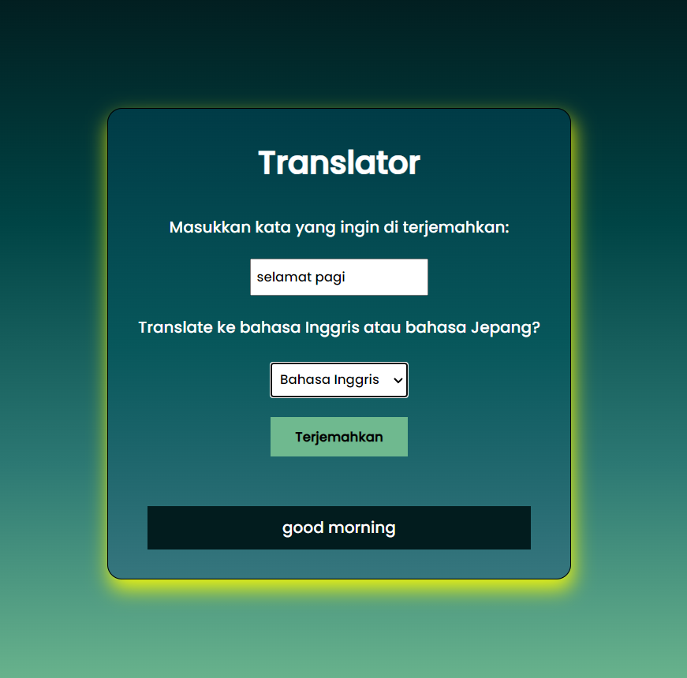

# Translator Website



Translator Website is a simple application that allows users to translate words or sentences from one language to another.

## Features

- Selection of source and target languages for translation.
- Clean and simple user interface.
- Integration with translation services for accurate translation results.

## How to Use

### Download using ZIP available on GitHub

1. Click on the CODE section (located in the top right corner).
2. Click on Download ZIP.

### Download using terminal

1. Ensure you have Python and pip installed on your computer.
2. Clone this repository:

   - ```bash
     git clone https://github.com/alfajarjaya/translate.git

     Change to the project directory:
        cd translator-website


### Running the Application

1. Run the Flask application:
   - python app.py
   - Open your browser and access http://localhost:3000.
   
   
### Usage

1. Enter the text you want to translate into the input.
2. Select the source and target languages from the dropdown.
3. Click the "Translate" button to view the translation results below.

## Contact

If you have any questions or suggestions, please contact me at [alfajjar123@gmail.com.]